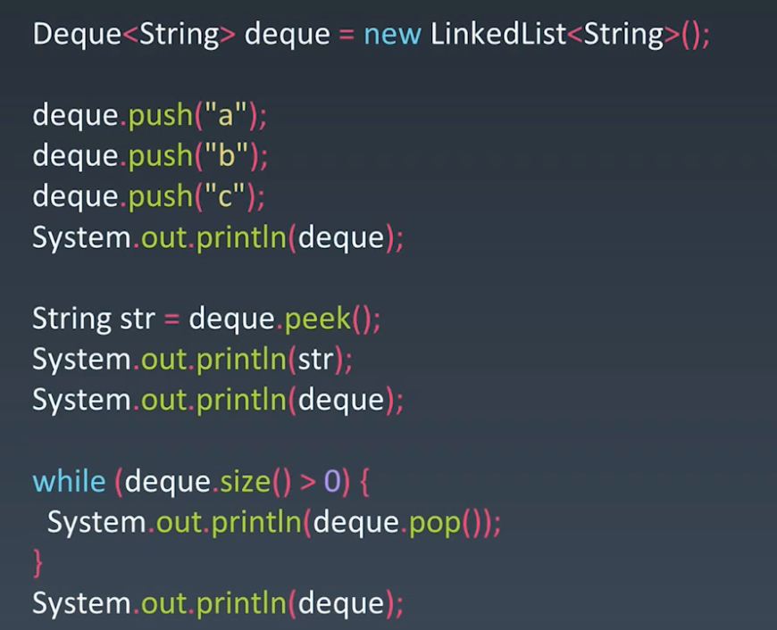

## Stack & Queue 关键点
- Stack：先入后出；添加、删除皆为 O(1）
- Queue：先入先出；添加、删除皆为 O(1）

## 双端队列 deque
Deque = double ended queue

## 查接口
### java 
#### stack
- java.lang.Object
  - java.util.AbstractCollection<E>
    - java.util.AbstractList<E>
      - java.util.Vector<E>
        - java.util.Stack<E>

API:

1. empty()
2. peek()
3. pop()
4. push(E item)
5. search (Object o)
#### queue
#### deque

